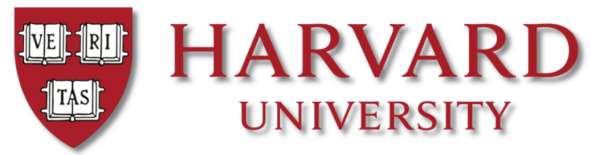
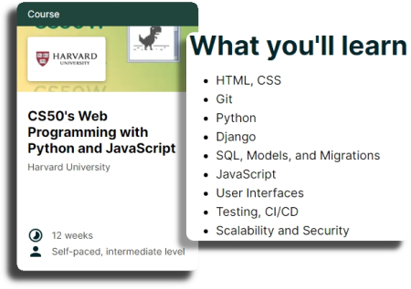
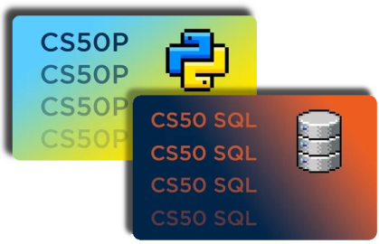

# Web Programming with Python and JavaScript

## Index

- [Planning for Success: My Personal Roadmap](#planning-for-success---my-personal-roadmap)
 
- [What You See is What You Get: HTML & CSS](#what-you-see-is-what-you-get---html-and-css)

## Planning for Success - My Personal Roadmap

The CS50W course aims to teach full-stack web development, covering a wide range of topics that provide a solid foundation for building modern web applications. This is the main course that I have taken.

Harvard University also offers other Computer Science courses, including a Python course and a SQL course, which are aligned with Web Programming. I have taken these as supplementary courses as well.

## What You See is What You Get - HTML and CSS